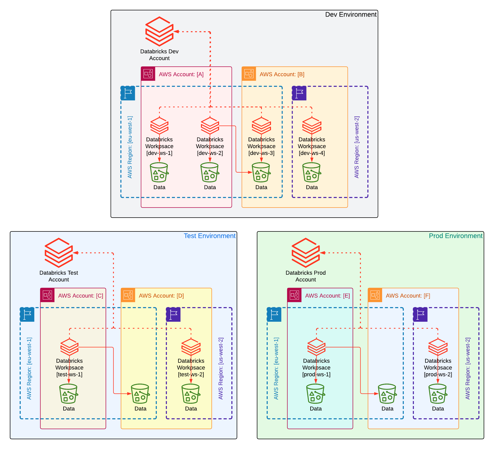

# Terraform designs for Databricks deployment

The purpose of this repository is to show different ways to design and structure a Terraform based deployments of Databricks. Shown here are only three different approaches but  surely there are many more ways to tackle this. If you know of other approaches that worked for you, and they are significantly different from those shown here (e.g. a different tool or structure is used) then we'd love to hear from you; just add a PR with your solution with a catchy name.

## Requirements

Following is required to deploy these template

- Admin level access to an existing Databricks account
- Databrics Service Principle with `Account Admin` priveledges (and a corresponding secret)
- [Terraform](https://developer.hashicorp.com/terraform/install?product_intent=terraform)
- [Terragrunt](https://terragrunt.gruntwork.io/docs/getting-started/install/)

## Scenario

A commmon, and a recommended way to create multiple environments using Databricks is to use a separate Databricks workspace per environment. However, there are cases when this workspace-based environment separation may not be sufficient (e.g. a Production environment needs to comform to some regulatory standard in which case it may require Ehhanced Security Monitoring enabled at the account level, but a Development environment does not have that requirement).

This is the scenario we are exploring here; a separate Databricks account is use for each environment. There are 3 environmens - Dev, Test and Prod, and each can have multiple workspaces. Here are some high level environment properties are:

- Workspaces in Test and Prod require more rigid controls, e.g. only certain resources with only a subset of pre-configured options could be created there
- Test workspaces are disposable; they are created and dropped regularly 
- Dev workspaces are more diverse diverse in terms of features they use and configurations, e.g. `ws-1` in Dev may use real-time model serving whereas `ws-2` workspace may not require any ML/AI capabilities

Here is a diagram showing what we are aiming to achieve. 

***Note:** only a subset of components shown here may be deployed by each project.*



## Designs

*Pros and Cons presented here are not exhaustive, we only picked the main ones*

1. The first design decision was to utilise Terraform modules whenever possible and follow the Single Responsibility Principle when designing them to create highly cohesive and granular reusable components. In other words, resources that always work together may need to be created within the same module but only if they don’t make it unnecessarily difficult for a module to work together with other modules. This is a common best practice approach so no further justification was required.
    - Pros: code reuse, centralised code management and governance, best practice
    - Cons: more effort to design modules, higher chance of conflicts as the number of deployments grow

2. The second design decision was to use complex variable types to group together module properties instead of using individual property values. This creates leaner module instance declaraions and allows a better management of module properties, e.g. all the module specific variable values are grouped together and if new values are introduced then only the variable definition and corresponding structure containing the values need to be changed without changing the module instance declaration. However, in some cases this may result in repeated information with the risk of potential misconfiguration, e.g. a workspace requires a `region` parameter and if a single project is deploying multiple workspaces then each workspace variable will have its own region value, which could a be a good thing if workspaces are deployed to different regions but will result in repeated values (and potential misconfiguration) if they are in the same region (having a single `region` parameter in this case would remove that risk). Benefits of using complex variables outweighted the possible issues so we decided to go with that.
    - Pros: better visibility, leaner module instances
    - Cons: possible variable value duplication

3. Next decision was to use JSON files to define variable values instead of `.tfvar` files. JSON is easier to generate and parse which could simplify testing (e.g. programmatically generate test configurations) and reuse (e.g. programmatically read and validate parameter values against a centralised configuration to monitor conformance)
    - Pros: easier to generate and parse programmatically, can be used outside the Terraform
    - Cons: JSON files need to be explicitly parsed within the Terraform templates

4. We chose a tiered approach to desinging the Terraform projects. At the first level, the designs are split into `coarse` or `granular`. 
- `coarse`: large deployments when many resources are defined in the same Terraform project. This results in a large state containing many resources which may lead to a slower deployment. For this type of design we decided to use a single Terraform project for the entire environment, but we could have equally gone larger (e.g. all the environments in a single project) or smaller (e.g. a project per workspace).
    - Pros: reduced number of deployments, simpler to manage, all resources in one place
    - Cons: slower deployments, large blast radius in case something goes wrong with the deployment

- `granular`: smaller multiple Terraform projects each responsible for deploying only a subset of resources. There are many approaches to decide how to do a split overall deployment into smaller ones; we used the expected frequency of changes:
    1. `account`: a single Terraform project per environment responsible for managing the Databricks account level resources, e.g. metastores
    2. `workspace`: a Terraform project to deploy a single Databricks workspace with the essential components only
    3. `workspace`: a Terraform project to deploy all the additional resources within a single Databricks workspace

    - Pros: flexible individual deployments, smaller blast radious in case something goes wrong with the deployment
    - Cons: more design work, more deployment processes to manage

3. The `granular` design is further split into 2 to show different approaches:
- `replicated`: every deployment is an independent Terraform project, each containing the configuration and the modules (plus, if necessary, any additional custom resources which are not provided by the modules)
    - Pros: fully independent deployments
    - Cons: code repetition, more maintenance as the number of deployments grow

- `dry`: the design consists of shared Terraform modules and an independent configuration per deployment (plus, if necessary, any additional custom resources which are not provided by the modules). This implementation requires additional tooling because the functionality is not supported by Terraform (closest Terraform tool is probably [CDK for Terraform](https://developer.hashicorp.com/terraform/cdktf) but it is still unstable and may not be suitable for production deployments), we selected [Terragrunt](https://terragrunt.gruntwork.io/) for that but there are other tools that could provide similar functionality. 
    - Pros: best practice for designing multi-part solutions (DRY - don't repeat yourself), less code duplication
    - Cons: requires additional tooling, may result in addition deployment-specific resources if the shared modules do not support those

    Alternatively, if you don't have access to those tools for some reason (e.g. if your environment is under a strict control in terms of tools that can be used) but can write code in some language then you can easily develop your own custom tool. It does not have to have all the features of tools like Terragrunt but only enough to cover your needs. We have included an example of such a tool, called [Hydrator], that we built for this project in Python. All you need to use it is Python (and Terraform of course). For more information see [README](granular/aws/dry/hydrator/README.md) in `granular/aws/dry/hydrator`


## Conclusion

From the scenario, `coarse` design looks a better fit for Test environment where everything is deployed in one go. We used the `replicated` approach to avoid dependency on extra tooling. *Note* that here we are deploying 2 workspaces into Test environment in different regions. We had to look some variable values at the apply time (e.g. `metastore_id` property of the workspace) because everything is created in a single deployment, and restructure the `variables.json` file (e.g. grouping `workspace-items` under a relevant `workspace`).  

Dev and Prod may require more `granular` design approach so that teams in Dev will have more flexibility and Prod environment is more robust and resilient to possible misconfigurations (e.g. a possible mistake could be made to cluster deployment template effecting a service but not the overall availability of the platform or unrelated services because cluster and workspace will use different deployments/states) and results in faster deployments.

Furthermore, the Dev environment will use a `replicated` design as it offers the most flexibility, whereas Prod environment will adopt the `dry` design that will allow better governance and standardisation over the deployed resources.

## Quick Start

### Configuration

Databricks account admin rights are required to create some of the resources here (e.g. creating a metastore or a workspace), whereas some resources will only need access to a Databricks workpace (e.g. create a cluster in the workspace). 

A `config.sh` file sets environmental variables that can be used to configure common deployment properties (but not the actual resource variable values) and some values which are recommended to be managed via environmental variables (e.g. credentials). Some of those variables may not apply to some deployments but there is no harm in having them all in the same place for this demo. You can always split it into config files with smaller scopes if needed, e.g. there may be no need to export account credentials for managing workspace resources.

### Execution

Most of the deployments here use Terraform direcltly, except for those using `dry` approach - you can use either Terragrunt or Hydrator for those.

- For Terraform:
```
terraform init
terraform plan
terraform apply
```

- For Terragrunt:
```
terragrunt plan
terragrunt apply
```

- For Hydrator (for `account` deployment, for more examples see [Hydrator](granular/aws/dry/hydrator))
```
python ../../../hydrator/hydrator.py plan
python ../../../hydrator/hydrator.py apply
```

## Disclaimer

This project is provided for informational purposes only. It is not created or formally supported by Databricks. Code are provided AS-IS and we do not make any guarantees of any kind.

- Parse lists
